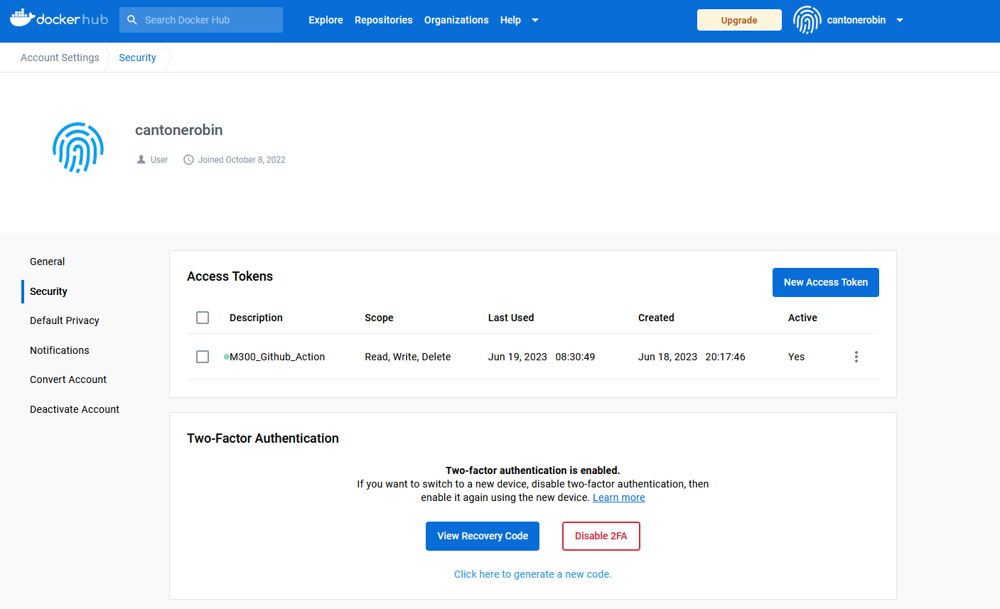
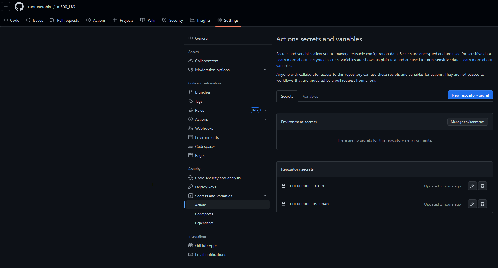
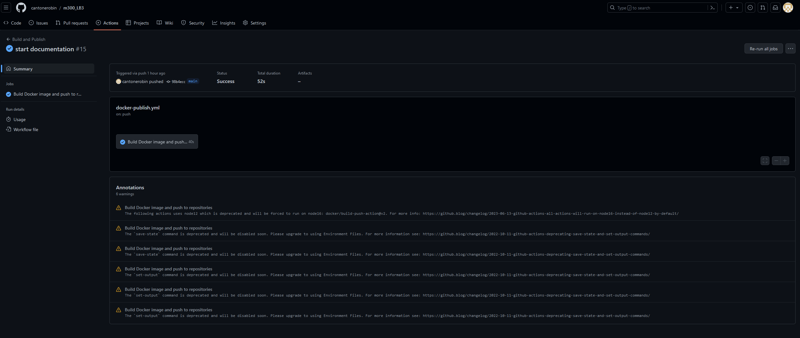
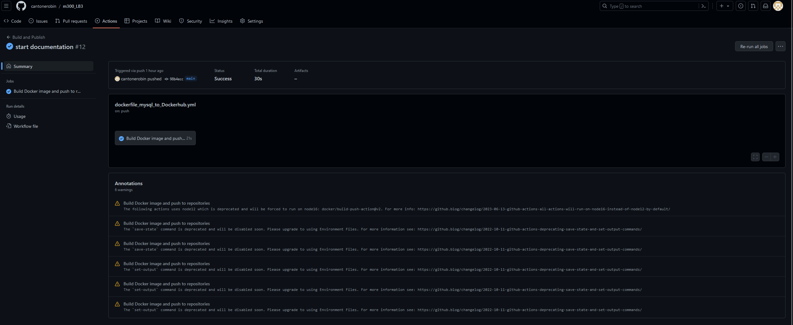

# Github Action
The GitHub Actions can automatically build a new image and push it to the registry at DockerHub when the developer releases changes. 

## DockerHub Access Token 
For this to work we have to create an Access Token in Dockerhub. This will later be used in the GitHub Action.

## GitHub Secrets
For the GitHub Action we have to create 2 Secrets. This secret will be used in the GitHub Action later.

## GitHub Action File
With GitHub Action we can trigger a docker Build Job whenever the developer does push to the main branch. 

[Apache Action File](/.github/workflows/dockerfile_apache_to_Dockerhub.yml)

[MySQL Action File](/.github/workflows/dockerfile_mysql_to_Dockerhub.yml)

Both files are almost identical, they only differ in the part where the image is tagged.

## Logs

**Here you see an overview of the Action for Apache**

**Here you see an overview of the Action for MySQL**

For more informations you can visit the Repository.
https://github.com/cantonerobin/m300_LB3/actions

Ressources: https://event-driven.io/en/how_to_buid_and_push_docker_image_with_github_actions/